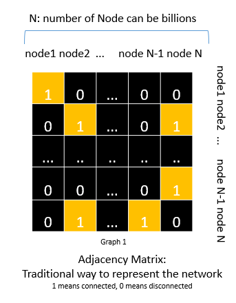
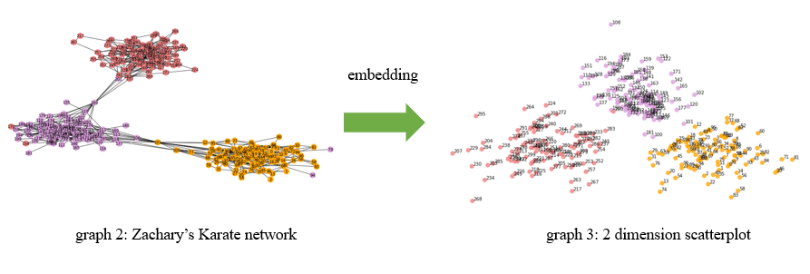

## Introduction:  Network Embedding (DeepWalk Method)Applications
- **Network embedding methods aim at learning low-dimensional latent representation of nodes
in a network**. These representations can be used as features for a wide range of tasks on graphs
such as classification, clustering, link prediction, and visualization
- As we know,Given a network’s structure, **it is often desirable to predictmissing information (frequently called attributes or labels)** associated with each node in the graph,for exmaple on a social
network they might represent the communities a person belongs to, or the categories of a document’s
content on the web but in the real-world social network, information networks can contain billions of nodes and edges and the adjacency matrix (graph 1), a traditional way to present a network is intractable to perform complex inference procedures on the entire network.
- One technique which has been proposed to address this problem is network embedding. The central idea is to find a mapping
function which converts each node in the network to a low-dimensional latent representation. These
representations can then be used as features for common tasks on graphs such as classification,
clustering, link prediction, and visualization.

- Scenario: I create the random connected network with 500 nodes to demostrate the application of network embedding. You can see the social network has 3 communities (graph 2). We convert it to be a 2 dimension graph (graph 3)

References:
Haochen Chen, Bryan Perozzi2, Rami Al-Rfou2, and Steven Skiena1: A Tutorial on Network Embeddings. August 9, 2018
https://arxiv.org/pdf/1808.02590.pdf
